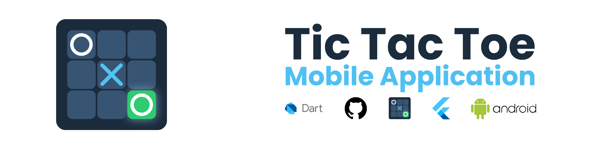

# Tic Tac Toe

A Flutter Tic Tac Toe game with two modes: classic pass-and-play on a single
device, and real-time multiplayer between two nearby phones over
Bluetooth/WiFi (no internet required).

Built as a practice project to explore Flutter animations, state management,
and peer-to-peer connectivity with `nearby_connections`.

## Features

- **Same Device** — two players share one phone, turn by turn
- **Nearby Multiplayer** — one phone hosts, the other joins; moves sync live
  over Bluetooth/WiFi using [`nearby_connections`](https://pub.dev/packages/nearby_connections)
- Player name saved on first launch (shown to opponents in nearby mode)
- Turn order alternates each new game — whoever went second last time goes
  first this time, so no one player always starts
- Animated splash screen, cell placement, and win highlighting

## Screenshots

<!-- Add screenshots here, e.g.: -->
<!--  -->

## Requirements

- Flutter SDK `^3.11.3`
- Android device (nearby multiplayer requires Bluetooth + WiFi hardware;
  same-device mode works on any Android device or emulator)

## Getting Started

```bash
git clone <this-repo-url>
cd tic_tac_toe
flutter pub get
flutter run
```

## Dependencies

| Package | Purpose |
|---|---|
| `nearby_connections` | Peer-to-peer Bluetooth/WiFi connection for multiplayer |
| `permission_handler` | Requests Bluetooth/location permissions at runtime |
| `shared_preferences` | Persists the player's name across app restarts |
| `flutter_launcher_icons` | Generates the app icon |

## Permissions

Nearby Multiplayer needs the following Android permissions (already declared
in `android/app/src/main/AndroidManifest.xml`):

- Bluetooth (`BLUETOOTH_SCAN`, `BLUETOOTH_ADVERTISE`, `BLUETOOTH_CONNECT`,
  and the legacy `BLUETOOTH` / `BLUETOOTH_ADMIN` for older Android versions)
- WiFi (`ACCESS_WIFI_STATE`, `CHANGE_WIFI_STATE`, `NEARBY_WIFI_DEVICES`)
- Location (`ACCESS_FINE_LOCATION`, `ACCESS_COARSE_LOCATION`) — required by
  Android for Bluetooth/WiFi device discovery, not used for anything else

The app requests these at runtime when entering Nearby Multiplayer. See
[USER_GUIDE.md](USER_GUIDE.md) for what to expect when granting them.

## How Nearby Multiplayer Works

1. One player taps **Host Game** — their phone starts advertising.
2. The other player taps **Join Game** — their phone scans for nearby hosts
   and lists any found.
3. Tapping a discovered host sends a connection request; once accepted, the
   host plays as **X** and the guest as **O**.
4. Moves are sent as small JSON payloads over the established connection.
5. Either player can tap **New Game** / **Reset Game** — the host always
   decides and broadcasts who starts next, so both phones stay in sync.

## Project Structure

This is a single-file Flutter app (`lib/main.dart`) containing:

- `SplashScreen` — startup animation, checks for a saved player name
- `NameEntryScreen` — first-run name entry
- `ModeSelectScreen` — choose Same Device or Nearby Multiplayer
- `TicTacToeScreen` — local two-player game
- `LobbyScreen` — host/join screen for nearby mode
- `NearbyGameScreen` — nearby multiplayer game and connection logic

## License

MIT — see [LICENSE](LICENSE).
